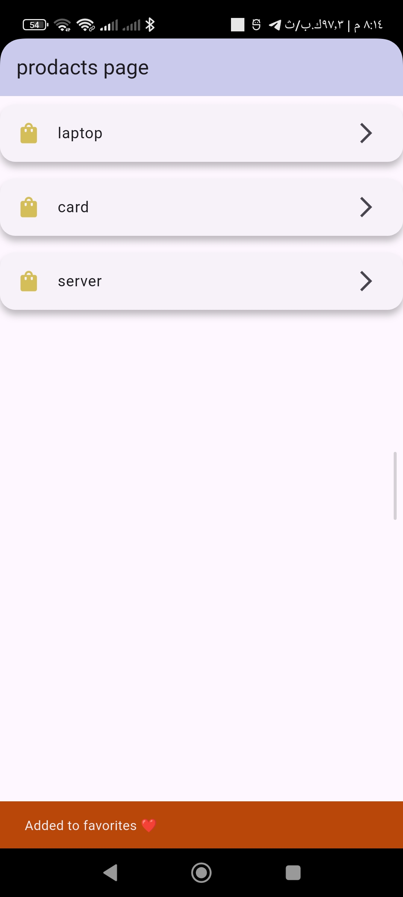
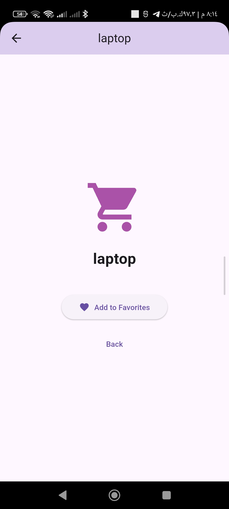

# activation_rout_pass
## pass and rout between pages
## Products Page
This screen presents a list of available products such as laptop, card, and server
Each item is interactive, allowing the user to select a product
When a product is selected, its data (product name) is passed to the next screen using Flutter navigation
The transition between screens is handled through Navigator (push)
## Screenshots

# Product Details Page
This screen displays the details of the selected product.
The product name is received from the previous screen and shown clearly.
The user can interact with the screen by adding the item to favorites.
Navigation back to the previous screen is handled using Navigator (pop).
## Screenshots

